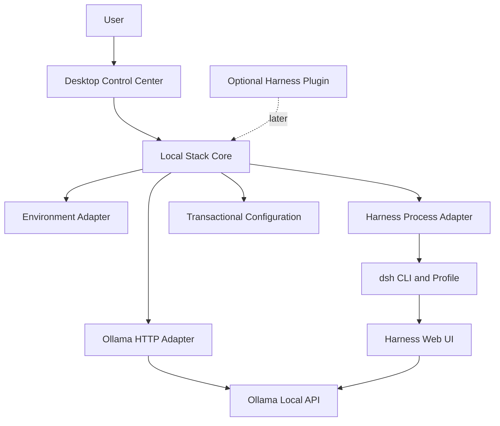

# Local Agent Stack

Local Agent Stack is an open-source desktop control plane for local AI coding
agents. It discovers and manages separately installed runtimes instead of
forking or bundling them.

The initial Windows release manages:

- Ollama health, installed models, running models, VRAM use, downloads and unloads.
- DeepSeek Harness health and a dedicated, app-managed launch process.
- Local environment diagnostics and editable runtime configuration.
- An embedded Harness workspace that remains separate from the control plane.

> [!IMPORTANT]
> This repository is an early working foundation. Service control is deliberately
> conservative: the application only stops processes it started itself.

## Architecture



See [docs/architecture.md](docs/architecture.md) for design boundaries and
[docs/roadmap.md](docs/roadmap.md) for the staged implementation plan.

## Development

Prerequisites:

- Windows 10/11 for the currently tested desktop target.
- Rust stable with the MSVC toolchain.
- Node.js 22 or newer and pnpm 10 or newer.
- Microsoft Edge WebView2 Runtime.

```powershell
pnpm install
pnpm check
cargo test --workspace
pnpm dev
```

To inspect the current machine without opening the desktop UI:

```powershell
cargo run -p local-stack-core --example snapshot
```

Ollama and DeepSeek Harness remain optional during development. The dashboard
will report them as unavailable rather than failing to launch.

## Configuration

The app stores its machine-local configuration outside the repository:

```text
%APPDATA%\dev.localagentstack\config\stack.json
```

Defaults are `http://127.0.0.1:11434` for Ollama and
`http://127.0.0.1:3000` for Harness. Commands and arguments can be changed in
the Settings panel.

## License

Apache-2.0. Local Agent Stack is free to use, modify and redistribute. Ollama,
DeepSeek Harness and downloaded models remain governed by their own licenses.
