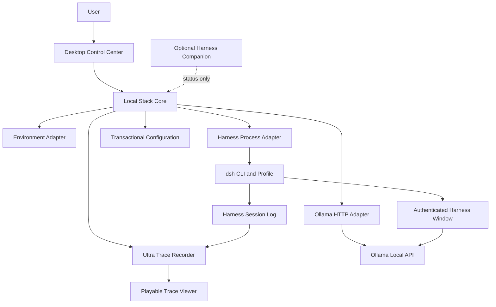

# Local Agent Stack

Local Agent Stack is an open-source desktop control plane for local AI coding
agents. It can discover separately installed runtimes or install verified,
app-owned runtime releases without forking their upstream projects.

The initial Windows release manages:

- Ollama health, installed models, running models, VRAM use, downloads, per-model unloads, and one-click release of all model VRAM.
- Verified, versioned Ollama installation with transactional activation and rollback.
- DeepSeek Harness health, authenticated application-window launch, and a dedicated app-managed process.
- One-click stack start with rollback on partial failure, plus ownership-safe shutdown that never terminates external services.
- A single-instance system-tray supervisor with stack start/stop, one-click VRAM release, and ownership-safe quit controls.
- In-app bounded Ollama and Harness log tails for local troubleshooting; logs remain local and are excluded from diagnostic exports.
- An update-safe Harness profile and optional `/local-stack` companion command.
- Guided first-run setup, editable runtime configuration, and redacted diagnostics.
- Version-aware compatibility status for independently updated runtimes.
- Signature-enforced in-app desktop updates with release-pipeline key isolation.
- A first-party Harness WebView window that preserves upstream browser authentication while remaining separate from the control plane.
- A playable Ultra Trace recorder that reconstructs complete model requests and responses, agent/workflow lineage, context occupancy, GPU telemetry, request queues, and reusable inference-slot leases from Harness's append-only session records.

> [!IMPORTANT]
> This repository is an early working foundation. Service control is deliberately
> conservative: the application only stops processes it started itself.

## Architecture



See [docs/architecture.md](docs/architecture.md) for design boundaries and
[docs/roadmap.md](docs/roadmap.md) for the staged implementation plan.

## Development

Prerequisites:

- Windows 10/11 for the currently tested desktop target.
- Rust stable with the MSVC toolchain.
- Node.js 22 or newer and pnpm 10 or newer.
- Microsoft Edge WebView2 Runtime.

```powershell
pnpm install
pnpm check
cargo test --workspace
pnpm dev
```

To inspect the current machine without opening the desktop UI:

```powershell
cargo run -p local-stack-core --example snapshot
```

To verify that the recorder can decode and reconstruct a real Harness session:

```powershell
cargo run -p local-stack-core --example inspect_trace -- <session-id>
```

To create or validate the configured update-safe Harness profile:

```powershell
cargo run -p local-stack-core --example prepare_profile
```

To export a support report without prompts, logs, credentials, or full paths:

```powershell
cargo run -p local-stack-core --example export_diagnostics
```

To import the tested Harness installation into app-owned versioned storage and
then smoke-test it on the isolated port used by development checks:

```powershell
cargo run -p local-stack-core --example install_managed_harness
cargo run -p local-stack-core --example smoke_managed_harness
```

To exercise the manifest-pinned Ollama installer from source, then verify its
normal supervisor lifecycle:

```powershell
cargo run -p local-stack-core --example install_managed_ollama
cargo run -p local-stack-core --example smoke_managed_ollama
```

The managed Ollama download is currently about 1.36 GB. The installer performs
a conservative free-space preflight of about 9.5 GB, streams the payload to a
staging directory, verifies its release-controlled SHA-256 digest, securely
extracts it, checks the reported version, and only then switches the active
release. A failed operation leaves the prior release and configuration active.

Ollama and DeepSeek Harness remain optional during development. The dashboard
will report them as unavailable rather than failing to launch.

## Configuration

The app stores its machine-local configuration outside the repository:

```text
%APPDATA%\localagentstack\Local Agent Stack\config\stack.json
```

Defaults are `http://127.0.0.1:11434` for Ollama and
`http://127.0.0.1:3000` for Harness. Commands and arguments can be changed in
the Settings panel.

On first launch, the setup checklist reviews those settings, prepares the
isolated profile, installs the companion, and runs a local health check. Every
step can be retried independently; choosing **Set up later** leaves runtimes
untouched.

The **Export diagnostics** action writes a timestamped JSON report to the
current user's Downloads directory. It includes service, model, GPU, driver,
and tool availability, but replaces full paths with executable names and omits
process messages, command arguments, logs, prompts, credentials, process
registry records, and Harness launch URLs.

Managed runtime workflows are available from **Runtime management**:

1. **Install managed Ollama** downloads the pinned official Windows archive,
   verifies its size and SHA-256 digest, extracts only safe paths into app-owned
   versioned storage, validates `ollama --version`, and atomically activates it.
2. **Rollback Ollama** switches back to the previous validated app-owned release.

The managed Harness workflow continues from the Harness service card:

1. **Install managed Harness** imports the tested external Harness package and
   a private Node executable into versioned app-owned storage. It validates the
   copy before switching the app configuration and never changes the source.
2. **Prepare profile** clones and validates an isolated profile without
   changing the stock `web` profile.
3. **Install companion** adds the versioned read-only bundle from the matching
   GitHub release and validates the composition again.
4. Start Harness from the control center and use `/local-stack` inside Harness
   to view runtime and GPU-memory status.

Each managed install receives a distinct release directory. The current and
previous releases remain side by side, and **Rollback** atomically switches the
active pointer after confirming the previous executable still exists. Runtime
state is stored under the operating system's local application-data directory;
full paths are excluded from diagnostic exports.

## System tray

Closing the dashboard hides it to the system tray instead of terminating the
supervisor. A left click restores the dashboard; the tray menu can start the
stack, stop only app-managed services, release all Ollama model VRAM, or quit.
The quit action first stops app-managed child processes and never terminates an
external Ollama or Harness process. Opening the desktop shortcut while the app
is hidden restores the existing instance instead of starting a second control
plane. App-owned process identity is persisted and verified, so a newly started
control plane can reattach to runtimes orphaned by an application crash or
forced update without relying on a port or process-name guess.

The compatibility strip uses [manifests/compatibility.json](manifests/compatibility.json)
to distinguish tested versions from runtimes that are too old or newer than the
tested range. This manifest is release-controlled; it never updates or
downgrades a separately installed runtime without an explicit user action.

## Desktop updates

The desktop updater accepts only artifacts signed by the project updater key.
The public key is embedded in the binary; its private counterpart is stored
outside the repository and in GitHub Actions' encrypted secret store. Release
tags must exactly match the version in `tauri.conf.json`. The release workflow
builds and signs the NSIS artifact, publishes its `.sig`, then advances the
static manifest under `updater/latest.json`.

On Windows, installing an update closes the application. The control center
refuses to begin an update while a service it launched is still running, which
prevents an owned Ollama or Harness child process from being orphaned. Updater
signatures authenticate update content; a separately purchased or identity-
validated Windows code-signing certificate is still needed to establish a
SmartScreen publisher identity.

## License

Apache-2.0. Local Agent Stack is free to use, modify and redistribute. Ollama,
DeepSeek Harness and downloaded models remain governed by their own licenses.
