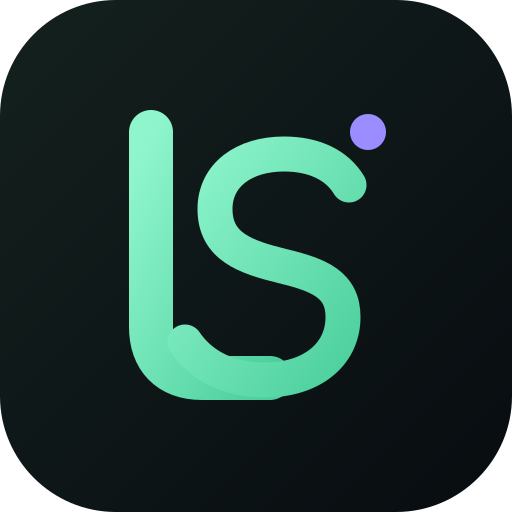
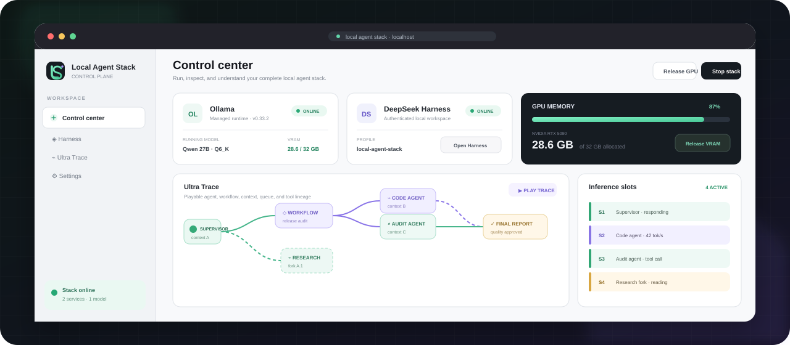
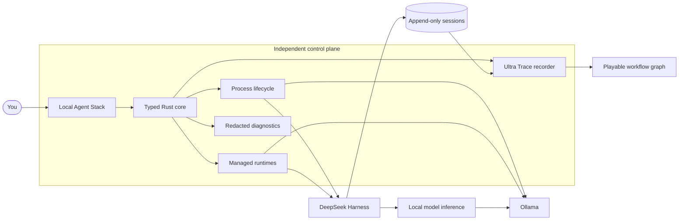

<p align="center">
  
</p>

<h1 align="center">Local Agent Stack</h1>

<p align="center">
  <strong>Run the whole local-agent workstation from one place.</strong><br>
  Install runtimes, launch Harness, control GPU memory, and replay every agent workflow—without giving up local ownership.
</p>

<p align="center">
  <a href="https://github.com/HanyangZZZ/local-agent-stack/actions/workflows/validate.yml"></a>
  <a href="https://github.com/HanyangZZZ/local-agent-stack/releases"></a>
  <a href="LICENSE"></a>
  
  
</p>

<p align="center">
  <a href="https://github.com/HanyangZZZ/local-agent-stack/releases"><strong>Download the latest alpha</strong></a>
  ·
  <a href="docs/architecture.md">Architecture</a>
  ·
  <a href="docs/roadmap.md">Roadmap</a>
  ·
  <a href="CONTRIBUTING.md">Contribute</a>
</p>

<p align="center">
  
</p>

## Your local AI stack finally feels like one product

Ollama runs the models. DeepSeek Harness runs the agents. Local Agent Stack is
the independent desktop control plane that makes them easy to install, operate,
observe, and recover.

Bring your existing runtimes or let the app manage verified copies alongside
them. Start the stack in one click, open the authenticated Harness workspace,
watch GPU use, release VRAM immediately, and inspect complex agent execution in
the playable Ultra Trace timeline.

> [!IMPORTANT]
> Local Agent Stack is alpha software. The Windows desktop is the currently
> tested target, and interfaces may change between prereleases.

## What makes it different

| | |
|---|---|
| **One-click lifecycle**<br>Start, stop, or restart Ollama and Harness as one transactional stack. A partial startup rolls back cleanly. | **Real GPU control**<br>See loaded models and VRAM use, unload one model, or release all Ollama GPU memory immediately. |
| **Bring your own—or go managed**<br>Keep independent installations untouched, or install verified app-owned runtime releases with rollback. | **Harness without authentication hacks**<br>Launch the real authenticated Harness UI in a dedicated application window using the URL issued by `dsh web`. |
| **Ultra Trace observability**<br>Replay model I/O, reasoning, tools, agents, workflows, context occupancy, GPU telemetry, queues, and slot leases. | **Recovery instead of guesswork**<br>Reattach only to verified app-owned processes after a crash. Never kill a process merely because its name or port looks familiar. |

## Ultra Trace: see the agent system, not a wall of logs

Ultra Trace reconstructs Harness's append-only session records into a readable,
playable execution graph while keeping every original record available in folded
detail.

- Step forward and backward through semantic execution scenes.
- Follow supervisor, subagent, fork, tool, report, and dynamic-workflow routing.
- Identify shared contexts by color and forks by striped context lineage.
- Watch agents enter and leave four reusable inference slots over time.
- See queued requests, context occupancy, GPU utilization, and VRAM at each step.
- Expand any node to inspect the exact system prompt, injected context, tool/MCP
  schemas, messages, reasoning, output, usage, and raw source records.

The durable Harness log remains the source of truth. Ultra Trace reads and joins
those records; it does not rewrite or replace Harness.

## Built for safe local operation

Local Agent Stack controls powerful local processes, so the safety boundary is
deliberately narrow:

- Management endpoints are loopback-only in the current release.
- The app stops only child processes it launched and can still verify.
- UI actions use typed, allowlisted operations—there is no arbitrary shell RPC.
- Managed installs verify origin, size, SHA-256, archive paths, and executable
  versions before atomic activation.
- Failed installs and configuration changes preserve the previous working state.
- Diagnostic exports redact paths and omit logs, prompts, arguments, credentials,
  process records, and Harness launch URLs.
- Desktop updates require a valid project updater signature.

Read the full boundary in [SECURITY.md](SECURITY.md) and
[docs/architecture.md](docs/architecture.md).

## Quick start

### Install the Windows alpha

1. Download the newest installer from [GitHub Releases](https://github.com/HanyangZZZ/local-agent-stack/releases).
2. Open Local Agent Stack and complete the guided setup checklist.
3. Choose your existing Ollama/Harness installations or install managed copies.
4. Select **Start stack**, then **Open Harness**.

Models are not bundled. Ollama, DeepSeek Harness, and downloaded models remain
subject to their own licenses.

### Run from source

You need Windows 10/11, Node.js 22+, pnpm 11, Rust stable with the MSVC
toolchain, and Microsoft Edge WebView2 Runtime.

```powershell
git clone https://github.com/HanyangZZZ/local-agent-stack.git
cd local-agent-stack
pnpm install --frozen-lockfile
pnpm dev
```

Ollama and DeepSeek Harness are optional for UI development. Missing services
appear as unavailable instead of preventing the control center from opening.

## How it fits together



The control plane remains useful even when Harness is stopped or unhealthy. It
does not fork Ollama, replace the Harness agent loop, or silently take ownership
of externally managed installations.

## Development

Run the complete local quality gate before opening a pull request:

```powershell
pnpm install --frozen-lockfile
pnpm check
pnpm format:check
pnpm lint
pnpm test
pnpm --filter @local-agent-stack/desktop build
pnpm audit --audit-level high
```

`pnpm check` also verifies release-version consistency, updater-key consistency,
compatibility-manifest invariants, schema presence, tracked-file hygiene, and
common secret patterns.

<details>
<summary><strong>Repository layout</strong></summary>

```text
apps/desktop/                 Tauri desktop application and web UI
crates/local-stack-core/      Runtime, lifecycle, configuration, and trace logic
packages/harness-companion/   Optional read-only Harness integration
manifests/                    Release-controlled runtime compatibility data
schemas/                      Public JSON schemas
scripts/                      Repository verification and local launch utilities
docs/                         Architecture, roadmap, and release documentation
updater/                      Public updater key and signed release metadata
```

</details>

<details>
<summary><strong>Useful core commands</strong></summary>

```powershell
# Inspect this machine without opening the desktop UI
cargo run -p local-stack-core --example snapshot

# Decode and reconstruct a Harness trace
cargo run -p local-stack-core --example inspect_trace -- <session-id>

# Prepare and validate the isolated Harness profile
cargo run -p local-stack-core --example prepare_profile

# Export a redacted support report
cargo run -p local-stack-core --example export_diagnostics

# Import and smoke-test a managed Harness installation
cargo run -p local-stack-core --example install_managed_harness
cargo run -p local-stack-core --example smoke_managed_harness

# Install and smoke-test the manifest-pinned Ollama runtime
cargo run -p local-stack-core --example install_managed_ollama
cargo run -p local-stack-core --example smoke_managed_ollama
```

</details>

## Project status

The Windows/NVIDIA foundation, managed Ollama and Harness runtimes, authenticated
Harness window, system-tray supervisor, signed updater pipeline, and Ultra Trace
replay are implemented. The next major areas are broader runtime adapters,
signed compatibility metadata, richer update channels, and macOS/Linux desktop
support.

See the [roadmap](docs/roadmap.md), [changelog](CHANGELOG.md), and
[release checklist](docs/release-checklist.md) for details.

## Contributing

Issues and focused pull requests are welcome. Start with
[CONTRIBUTING.md](CONTRIBUTING.md), follow the
[Code of Conduct](CODE_OF_CONDUCT.md), and use private vulnerability reporting
as described in [SECURITY.md](SECURITY.md).

## License

Licensed under [Apache-2.0](LICENSE). Local Agent Stack is free to use, modify,
and redistribute.
