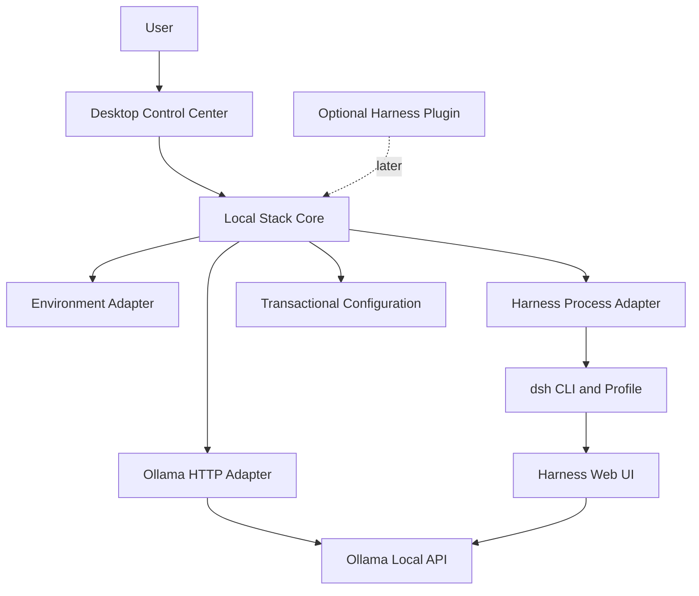

# Local Agent Stack

Local Agent Stack is an open-source desktop control plane for local AI coding
agents. It discovers and manages separately installed runtimes instead of
forking or bundling them.

The initial Windows release manages:

- Ollama health, installed models, running models, VRAM use, downloads and unloads.
- DeepSeek Harness health and a dedicated, app-managed launch process.
- An update-safe Harness profile and optional `/local-stack` companion command.
- Guided first-run setup, editable runtime configuration, and redacted diagnostics.
- Version-aware compatibility status for independently updated runtimes.
- An embedded Harness workspace that remains separate from the control plane.

> [!IMPORTANT]
> This repository is an early working foundation. Service control is deliberately
> conservative: the application only stops processes it started itself.

## Architecture



See [docs/architecture.md](docs/architecture.md) for design boundaries and
[docs/roadmap.md](docs/roadmap.md) for the staged implementation plan.

## Development

Prerequisites:

- Windows 10/11 for the currently tested desktop target.
- Rust stable with the MSVC toolchain.
- Node.js 22 or newer and pnpm 10 or newer.
- Microsoft Edge WebView2 Runtime.

```powershell
pnpm install
pnpm check
cargo test --workspace
pnpm dev
```

To inspect the current machine without opening the desktop UI:

```powershell
cargo run -p local-stack-core --example snapshot
```

To create or validate the configured update-safe Harness profile:

```powershell
cargo run -p local-stack-core --example prepare_profile
```

To export a support report without prompts, logs, credentials, or full paths:

```powershell
cargo run -p local-stack-core --example export_diagnostics
```

To import the tested Harness installation into app-owned versioned storage and
then smoke-test it on the isolated port used by development checks:

```powershell
cargo run -p local-stack-core --example install_managed_harness
cargo run -p local-stack-core --example smoke_managed_harness
```

Ollama and DeepSeek Harness remain optional during development. The dashboard
will report them as unavailable rather than failing to launch.

## Configuration

The app stores its machine-local configuration outside the repository:

```text
%APPDATA%\dev.localagentstack\config\stack.json
```

Defaults are `http://127.0.0.1:11434` for Ollama and
`http://127.0.0.1:3000` for Harness. Commands and arguments can be changed in
the Settings panel.

On first launch, the setup checklist reviews those settings, prepares the
isolated profile, installs the companion, and runs a local health check. Every
step can be retried independently; choosing **Set up later** leaves runtimes
untouched.

The **Export diagnostics** action writes a timestamped JSON report to the
current user's Downloads directory. It includes service, model, GPU, driver,
and tool availability, but replaces full paths with executable names and omits
process messages, command arguments, logs, prompts, and credentials.

The managed Harness workflow is available from the Harness service card:

1. **Install managed Harness** imports the tested external Harness package and
   a private Node executable into versioned app-owned storage. It validates the
   copy before switching the app configuration and never changes the source.
2. **Prepare profile** clones and validates an isolated profile without
   changing the stock `web` profile.
3. **Install companion** adds the versioned read-only bundle from the matching
   GitHub release and validates the composition again.
4. Start Harness from the control center and use `/local-stack` inside Harness
   to view runtime and GPU-memory status.

Each managed import receives a distinct release directory. The current and
previous releases remain side by side, and **Rollback** atomically switches the
active pointer after confirming the previous executable still exists. Runtime
state is stored under the operating system's local application-data directory;
full paths are excluded from diagnostic exports.

The compatibility strip uses [manifests/compatibility.json](manifests/compatibility.json)
to distinguish tested versions from runtimes that are too old or newer than the
tested range. This manifest is release-controlled; it never updates or
downgrades a separately installed runtime without an explicit user action.

## License

Apache-2.0. Local Agent Stack is free to use, modify and redistribute. Ollama,
DeepSeek Harness and downloaded models remain governed by their own licenses.
